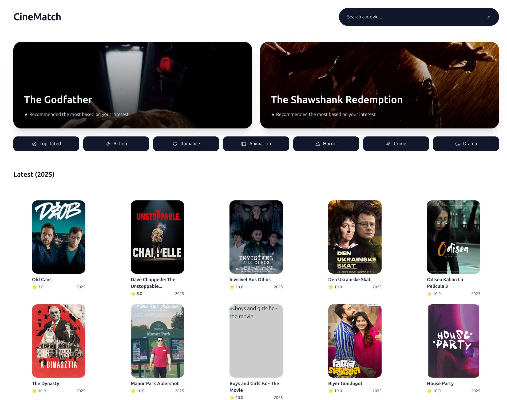
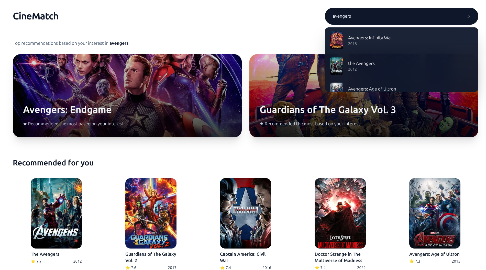

<div align="center">

# 🎬 CineMatch Frontend

### Next.js 16 + TypeScript | Responsive Movie Discovery UI

[](https://cinematch-recommender.vercel.app)
&nbsp;&nbsp;&nbsp;
[](https://github.com/IamShariqMukadam/cinematch-backend)

**Frontend for CineMatch - AI-powered movie recommendation system**

[Live Demo](https://cinematch-frontend-olive.vercel.app) • [Backend API](https://github.com/IamShariqMukadam/cinematch-backend) 

</div>

---

## 📸 Preview

<div align="center">
  
  
</div>

<details>
<summary><b>📱 Mobile View</b></summary>
<br/>
<p align="center">
  
  
</p>
</details>

---

## ⚡ Features

- 🔍 **Real-time Search** - Autocomplete dropdown with debounced API calls
- 🎨 **Fully Responsive** - Mobile-first design with Tailwind CSS
- 🚀 **Optimized Performance** - Next.js 16 with Image optimization
- 🎯 **Smart Navigation** - Browser history support (back/forward buttons work)
- 🎬 **TMDB Integration** - Click movies to view on TMDB
- ✨ **Smooth Animations** - Glassmorphism effects and transitions

---

## 🛠️ Tech Stack

- **Framework:** Next.js 16.1.1 (React 19)
- **Language:** TypeScript
- **Styling:** Tailwind CSS
- **UI Components:** Headless UI, Heroicons
- **Deployment:** Vercel

---

## 🚀 Quick Start

### Prerequisites
```bash
node >= 18.0.0
npm or yarn
```

### Installation

1. **Clone the repository**
```bash
git clone https://github.com/IamShariqMukadam/cinematch-frontend.git
cd cinematch-frontend
```

2. **Install dependencies**
```bash
npm install
# or
yarn install
```

3. **Set up environment variables**
```bash
# Create .env.local file
NEXT_PUBLIC_API_BASE_URL=https://shariqmukadam-cinematch-backend.hf.space
```

4. **Run development server**
```bash
npm run dev
# or
yarn dev
```

5. **Open** [http://localhost:3000](http://localhost:3000)

---

## 📁 Project Structure

```
frontend/
├── app/
│   ├── page.tsx              # Main homepage with state management
│   ├── layout.tsx            # Root layout with fonts
│   └── globals.css           # Global styles + responsive utilities
├── components/
│   ├── Navbar.tsx            # Search bar with autocomplete
│   ├── HeroCarousel.tsx      # Featured movie carousel
│   ├── GenreTabs.tsx         # Genre filter buttons
│   ├── MovieCard.tsx         # Individual movie card
│   └── MovieGrid.tsx         # Movie grid layout
└── public/
    └── screenshots/          # Demo images
```

---

## 🎨 Key Components

### Navbar
- Real-time search with 300ms debounce
- Dropdown suggestions with movie posters
- Keyboard navigation support

### HeroCarousel
- Displays top 2 recommended movies
- Responsive grid (1 col mobile, 2 col desktop)
- Click to view on TMDB

### MovieGrid
- Responsive grid (2-5 columns based on screen size)
- Lazy loading images
- Hover effects with smooth transitions

---

## 🔗 API Integration

Connects to [CineMatch Backend API](https://github.com/IamShariqMukadam/cinematch-backend)

```typescript
const API_BASE = process.env.NEXT_PUBLIC_API_BASE_URL;

// Example: Get recommendations
const res = await fetch(`${API_BASE}/recommend?movie=${query}`);
const data = await res.json();
```

---

## 📱 Responsive Design

- **Mobile:** < 640px (stack layout, compact UI)
- **Tablet:** 640px - 1024px (2-3 column grids)
- **Desktop:** > 1024px (full 5-column grid)

Uses consistent `container-padding` utility for perfect alignment across all screen sizes.

---

## 🚀 Deployment

Deployed on **Vercel** with automatic builds on push to main branch.

[](https://vercel.com/new/clone?repository-url=https://github.com/IamShariqMukadam/cinematch-frontend)

---

## 👨‍💻 Author

<h3 align = "center">Shariq Mukadam</h3>
<div align="center">
  
[](https://github.com/IamShariqMukadam)
&nbsp;&nbsp;&nbsp;&nbsp;&nbsp;
[](https://linkedin.com/in/yourprofile)
</div>


---

<div align="center">


⭐ Star this repo if you found it helpful!

</div>

